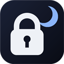

<p align="center">
  
</p>

<h1 align="center">Nightlatch</h1>

<p align="center">
  <b>A profile lock for Google Chrome™ that keeps the lock on the computer you locked.</b><br>
  Free, open source, no accounts, no telemetry, zero network requests.
</p>

<p align="center">
  <a href="docs/INSTALL.md">Install</a> ·
  <a href="SECURITY.md">Threat model</a> ·
  <a href="https://yzoe236.github.io/nightlatch/privacy.html">Privacy policy</a> ·
  <a href="LICENSE">MIT</a>
</p>

---

## Who this is for

You share a computer, and your Google profile is signed in on it.

- A **lab or office workstation** several people use
- A **front-desk or shared-workspace PC**
- A **family desktop** where everyone uses the same OS login
- A **classroom or library machine** you sign into repeatedly

Walk away for two minutes and anyone can read your mail, your history, your saved
sessions, and anything else a signed-in profile reaches. Locking the whole operating
system is the correct answer — and everyone forgets. Nightlatch is the second
curtain, for the times you forget.

## The bug it was built to fix

Several password-lock extensions store their *unlocked* flag in
`chrome.storage.sync`, which follows your Google account across machines. The
result is a quiet failure exactly where it hurts:

> You lock your browser on the shared lab computer and go home. At home you unlock
> your own browser — and the lab machine unlocks too, while you are nowhere near it.

The protection disappears precisely when you are not there to notice. Nightlatch
splits storage by intent so that cannot happen:

| Data | Stored in | Behaviour |
|---|---|---|
| Password (PBKDF2-SHA256 hash, 310k iterations, random salt) | `storage.sync` | Follows your account — set the password once, works everywhere |
| Shared preferences (timer, theme, protected sites) | `storage.sync` | One set of preferences on every machine |
| **Lock state** | **`storage.session`** | **Per device, per browser run. Never synced. Cleared on restart → always starts locked** |
| **Per-device switches**, failed-attempt log | `storage.local` | Per device. Never synced |

Unlocking at home can never unlock the lab machine.

## Features

- **Full-page lock overlay** drawn at `document_start`, before first paint, so page
  content never flashes. It lives in a closed shadow root, traps focus, swallows
  keyboard/mouse/scroll/copy events, and is rebuilt if page scripts remove it.
- **Profile-scoped idle auto-lock.** The timer measures inactivity *in this Chrome
  profile*, not system-wide idle — so other people using the computer under their
  own profile never reset your countdown. A tab playing audio counts as in use.
- **Locks on OS screen lock (Win+L) and on every browser restart.**
- **Per-device switch** to turn idle auto-lock off on machines only you use. It
  does not sync, so relaxing your home PC never weakens the shared one.
- **Strict mode** — while locked, `chrome://settings`, history, downloads,
  bookmarks, the password manager and the new-tab page redirect to the lock screen
  (content scripts cannot cover those pages).
- **Protected sites** — list hostnames (bank, mail) that ask for the password again
  once per browser run, even while the profile is unlocked.
- **Failed-attempt report** — on unlock you are told how many wrong passwords were
  tried while you were away.
- **Brute-force cooldown** — 4 free attempts, then 30 s doubling to a 5-minute cap.
- Manual lock with `Ctrl+Shift+L` or the toolbar button. Four lock-screen themes.

## Honest limitations

**This is a curtain against casual snooping, not a vault.** Anyone who opens
`chrome://extensions` and disables the extension gets past it — that is true of
every extension in this category, and we deliberately leave that page reachable so
you can never lock yourself out. On a shared machine the real baseline is `Win+L`
or a separate OS account; Nightlatch is a second curtain for the times you forget.

Full threat model: [SECURITY.md](SECURITY.md).

## Install

**Either way works — full step-by-step guide: [docs/INSTALL.md](docs/INSTALL.md).**

### From the Chrome Web Store

Search the store for **Nightlatch** and click *Add to Chrome*. Chrome keeps it updated
and installs it on your other signed-in computers for you.

<!-- STORE_URL --> *(listing link goes here once published)*

### From source (run the code you can read)

1. **Code → Download ZIP** on this page (or `git clone`), and unzip somewhere permanent —
   Chrome loads the extension from that folder on every start, so don't delete or move it.
2. Open `chrome://extensions` and enable **Developer mode**.
3. **Load unpacked** → select the folder.
4. The settings page opens on first run — set a password.

Repeat on each computer: extensions loaded this way neither install themselves on your
other machines nor auto-update. To update, replace the files and click **Reload (⟳)** on
the extension card.

Your **password syncs** (only its hash is stored), so you set it once. The **lock state
deliberately does not** — that is the whole point.

## Privacy

The extension has no backend, no account and no analytics. It never sends anything
anywhere — search the source for `fetch`, `XMLHttpRequest` or `WebSocket` and you
will find none. Your password is never stored, only a salted hash of it.

## Project layout

```
manifest.json    MV3 manifest
crypto.js        PBKDF2 hashing/verification + cooldown curve (worker, pages and Node tests)
background.js    Lock-state machine, auto-lock, strict-mode guard, messaging
content.js       Lock overlay, unlock UI, event trapping, tamper rebuild, activity heartbeat
themes.js        Lock-screen themes
locked.html/js   Landing lock screen for guarded internal pages
popup.html/js    Status, lock now, quick unlock, per-device toggle
options.html/js  Password, auto-lock, theme, protected sites
test/            node test/crypto.test.js
tools/           icon generator, screenshot capture, packaging
```

## Development

```bash
node test/crypto.test.js        # unit tests
node tools/package.js           # dist/nightlatch-transfer.zip  (keeps manifest "key" → stable ID)
node tools/package.js --store    # dist/nightlatch-store.zip     (strips "key"; the store assigns the ID)
```

`manifest.json` contains a `key` field that pins the extension ID so the same
unpacked install on several machines shares one identity (and therefore one synced
password). The matching private key is **not** in this repository and must never be
committed. Remove the `key` field before uploading to the Chrome Web Store — the
`--store` build does this for you.

## Status

Pre-1.0. Core behaviour is covered by unit tests; the multi-machine guarantee
should be verified on your own two computers before you rely on it.

## License

[MIT](LICENSE) © Linhan Li
